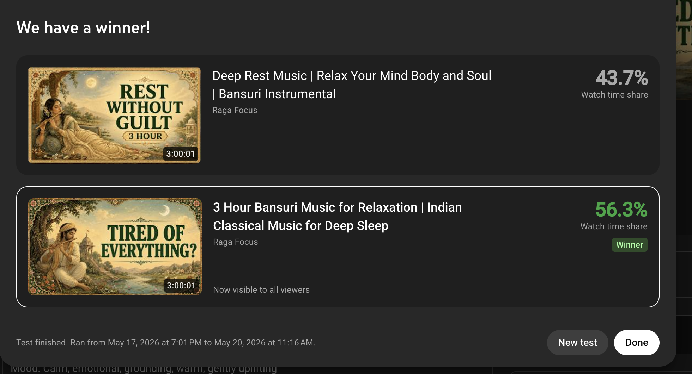
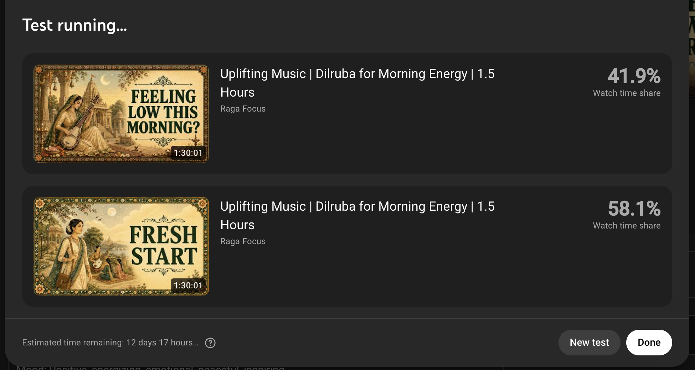
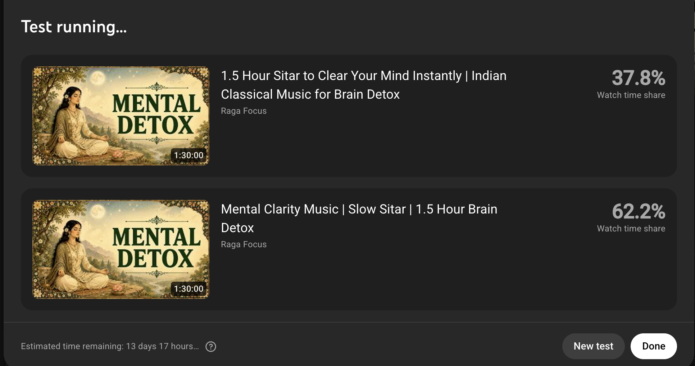
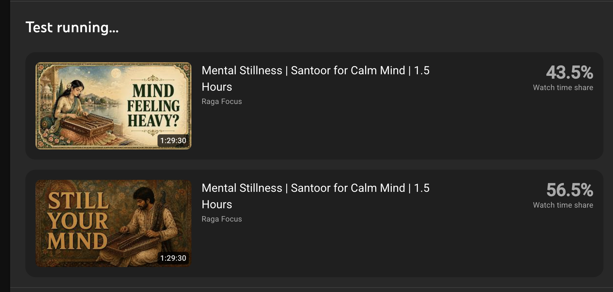

# A/B Test Archive — Raw Screenshots + Verdicts

One entry per test. Add new tests here as screenshots come in.
Raw image files live alongside this doc (`data/ab_raw/`).
Structured verdicts also in `data/ab_results.csv`.

Naming convention for files: `test_NN_YYYY-MM-DD_slug_STATUS.png`

---

## Test 19 · May 17–20 · Bansuri Deep Sleep · ✅ CONCLUDED

**Lane:** Sleep / Deep Rest  
**Test type:** Title + Thumb (both variables changed — not isolated)  
**Status:** CONCLUDED — B won  

| | Variant A | Variant B |
|---|---|---|
| **Title** | Deep Rest Music \| Relax Your Mind Body and Soul \| Bansuri Instrumental | 3 Hour Bansuri Music for Relaxation \| Indian Classical Music for Deep Sleep |
| **Thumb text** | REST WITHOUT GUILT | TIRED OF EVERYTHING? |
| **Watch time share** | 43.7% | **56.3% ✅ Winner** |

**Margin:** 12.6pp  
**Key finding:** Exhaustion-state Q-hook thumb (`TIRED OF EVERYTHING?`) + sleep-descriptor title beat permission-statement thumb + soft-rest title. Variables not isolated — both title and thumb changed. Tentative: exhaustion-state Q-hook is strong in sleep/rest lane. Cross-references Test 16 (outcome-imperative `DRIFT TO SLEEP` also won sleep) — possible nuance: type of Q-hook matters (exhaustion-state = strong; anxiety Q = medium). More isolation needed.



---

## Test 20 · May 19 · Brain Detox Sitar · 🔄 Running

**Lane:** Brain Detox / Cognitive Clarity  
**Test type:** Title-only (both thumbs: MENTAL DETOX — same image)  
**Status:** Running · ~13 days remaining as of May 19  

| | Variant A | Variant B |
|---|---|---|
| **Title** | 1.5 Hour Sitar to Clear Your Mind Instantly \| Indian Classical Music for Brain Detox | Mental Clarity Music \| Slow Sitar \| 1.5 Hour Brain Detox |
| **Thumb text** | MENTAL DETOX | MENTAL DETOX |
| **Watch time share** | 37.8% | **62.2% 🔄 Leading** |

**Margin:** 24.4pp (decisive)  
**Key finding:** Clean SEO-led 3-slot title crushes duration-led 2-slot title in cognitive lane. Extends Test 17 (Sarod Brain Fog, same finding) to Sitar. Duration as title lead = weak signal. 3-slot SEO-first format is dominant across instruments.



---

## Test 21 · May 19 · Morning Dilruba · 🔄 Running

**Lane:** Morning / Uplifting  
**Test type:** Thumb-only (identical titles both variants)  
**Status:** Running · ~12 days remaining as of May 19  

| | Variant A | Variant B |
|---|---|---|
| **Title** | Uplifting Music \| Dilruba for Morning Energy \| 1.5 Hours | Uplifting Music \| Dilruba for Morning Energy \| 1.5 Hours |
| **Thumb text** | FEELING LOW THIS MORNING? | FRESH START |
| **Watch time share** | 41.9% | **58.1% 🔄 Leading** |

**Margin:** 16.2pp (decisive)  
**Key finding:** Lifestyle/outcome thumb (`FRESH START`) beats exhaustion Q-hook (`FEELING LOW THIS MORNING?`) in morning lane. Aligns with Tests 14 + 18: morning lane = outcome/lifestyle thumb wins; Q-hook loses in morning even when emotionally relevant.



---

## Test 22 · May 20 · Mental Stillness Santoor · 🔄 Running

**Lane:** Calm / Stillness  
**Test type:** Thumb-only (identical titles both variants)  
**Status:** Running · early signal only (no time estimate visible)  

| | Variant A | Variant B |
|---|---|---|
| **Title** | Mental Stillness \| Santoor for Calm Mind \| 1.5 Hours | Mental Stillness \| Santoor for Calm Mind \| 1.5 Hours |
| **Thumb text** | MIND FEELING HEAVY? | STILL YOUR MIND |
| **Watch time share** | 43.5% | **56.5% 🔄 Leading** |

**Margin:** 13pp (directional — too early to conclude)  
**Key finding (tentative):** Outcome-statement thumb (`STILL YOUR MIND`) edges Q-hook in calm/stillness lane. Possible sub-lane split emerging: `stillness/mental` framing → outcome-statement wins; `anxiety/relaxation` framing → Q-hook wins (Test 15). Do not update lane-thumb rules until test concludes.



---

## How to add a new entry

1. Screenshot the YouTube A/B test panel (both variants visible + watch time share %).
2. Save image as `test_NN_YYYY-MM-DD_slug_STATUS.png` in `data/ab_raw/`.
3. Copy the template block below, fill in all fields, paste above the `---` at bottom.
4. Update `data/ab_results.csv` with the structured verdict row.

### Template

```
## Test NN · Month DD · Video Name · STATUS

**Lane:** X  
**Test type:** Title-only / Thumb-only / Title+Thumb  
**Status:** Running / CONCLUDED  

| | Variant A | Variant B |
|---|---|---|
| **Title** | ... | ... |
| **Thumb text** | ... | ... |
| **Watch time share** | X% | Y% |

**Margin:** Xpp  
**Key finding:** ...


---
```
